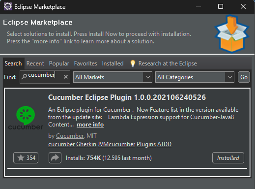
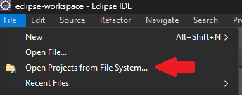
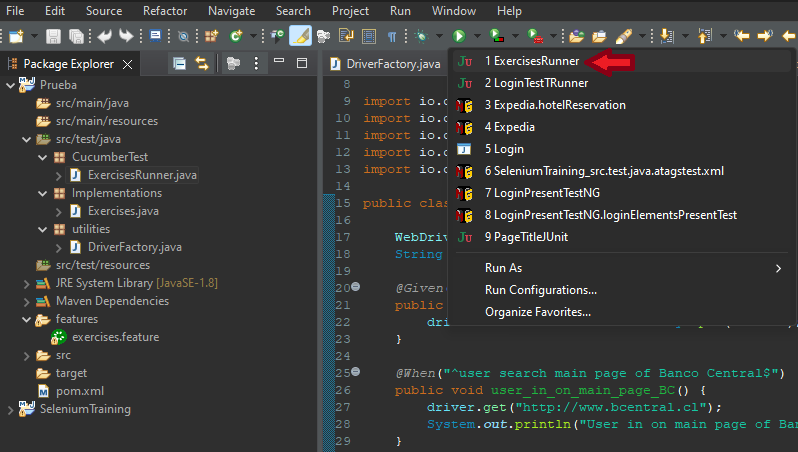
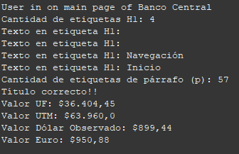
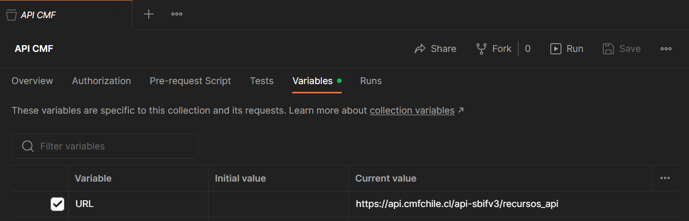
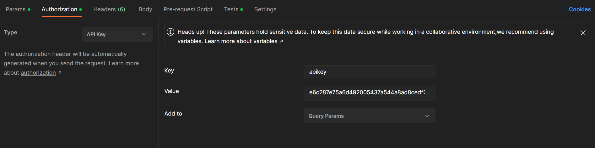
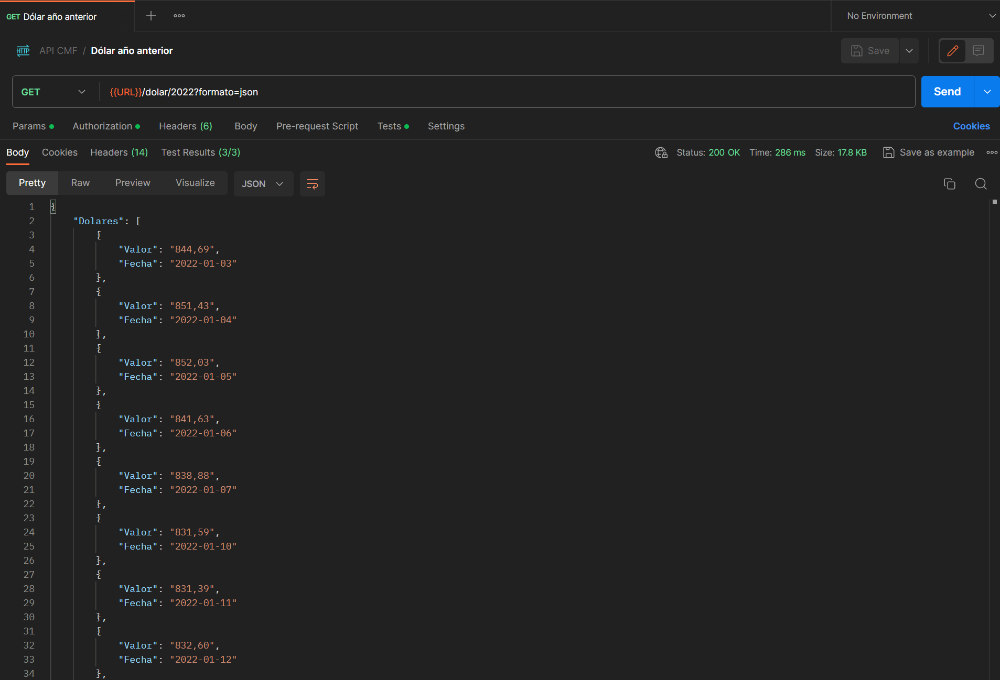
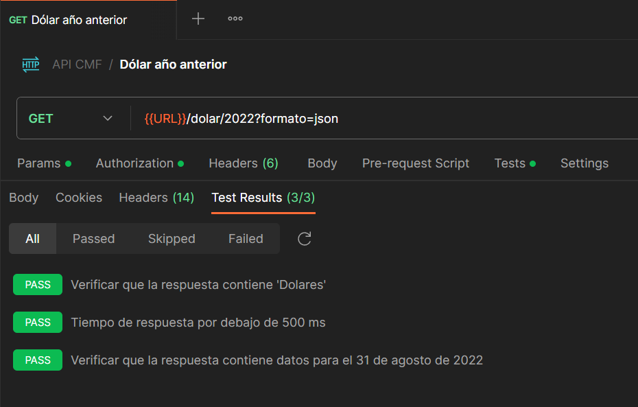
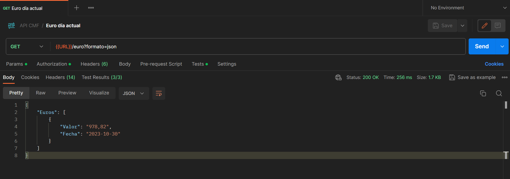
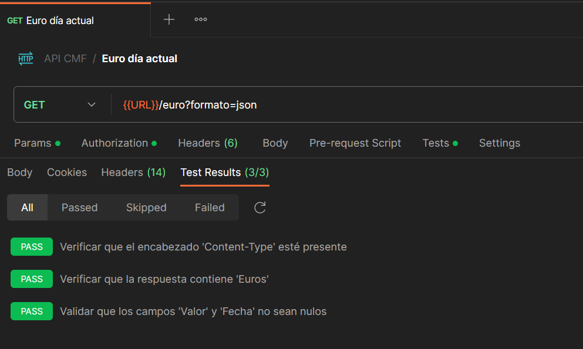

# PruebaEurekaQA

El presente repositorio contiene los ejercicios solicitados para la prueba QA Automatizador - Eureka.

## Ejercicio 1

Pruebas automatizadas sobre el sitio web del Banco Central con el lenguaje de programación Java y los complementos Selenium y Cucumber.

### Stack Tecnológico

- SO: Windows 10
- Google Chorme
- IDE Eclipse
- Java JDK 17.0.8
- Maven: https://mvnrepository.com
- Selenium
- Cucumber

**Instalación:** Las herramientas que se deben descargar son: 
- Google Chorme: https://www.google.com/intl/es_es/chrome

- Eclipse: https://www.eclipse.org/downloads/download.php?file=/oomph/epp/2023-09/R/eclipse-inst-jre-win64.exe

    Al ser un ejecutable, una vez descargado ya puede utilizarse sin instalación previa.

-  JDK Java: https://www.oracle.com/cl/java/technologies/downloads/#jdk17-windows

    Se recomienda instalar el MSI Installer y clickear *Next* en cada ventana emergente.
    
    Para revisar que se ha instalado correctamente y agregado al PATH, abrir la terminal y utilizar el comando:
    ```cmd
    java --version
    ``` 

- Plugin Cucumber: Si bien la dependencia de Cucumber será manejada con Maven, de igual forma se recomienda instalar el plugin de Cucumber en el IDE. Para ello, en la sección superior clickear *Help* y posteriormente *Eclipse Marketplace*.



**Dependencias:** Para las dependencias propias del código se utilizó Maven como gestor de dependencias, las cuales se pueden encontrar en el [Repositorio Maven](https://mvnrepository.com). Por tanto, no deben ser instaladas, se recomienda corroborar que el código pom tenga se vea así:
```xml
<project xmlns="http://maven.apache.org/POM/4.0.0" xmlns:xsi="http://www.w3.org/2001/XMLSchema-instance" xsi:schemaLocation="http://maven.apache.org/POM/4.0.0 http://maven.apache.org/xsd/maven-4.0.0.xsd">
  <modelVersion>4.0.0</modelVersion>
  <groupId>Eureka</groupId>
  <artifactId>Prueba</artifactId>
  <version>0.0.1-SNAPSHOT</version>
    <dependencies>
	<dependency>
    	<groupId>org.seleniumhq.selenium</groupId>
    	<artifactId>selenium-java</artifactId>
    	<version>4.14.1</version>
	</dependency>
	<dependency>
	    <groupId>io.github.bonigarcia</groupId>
	    <artifactId>webdrivermanager</artifactId>
	    <version>5.5.3</version>
	    <scope>test</scope>
	</dependency>
	<dependency>
	    <groupId>io.cucumber</groupId>
	    <artifactId>cucumber-java</artifactId>
	    <version>7.14.0</version>
	</dependency>
	<dependency>
	    <groupId>io.cucumber</groupId>
	    <artifactId>cucumber-junit</artifactId>
	    <version>7.14.0</version>
	    <scope>test</scope>
	</dependency>
	<dependency>
	    <groupId>io.cucumber</groupId>
	    <artifactId>cucumber-core</artifactId>
	    <version>7.14.0</version>
	</dependency>
	<dependency>
	    <groupId>junit</groupId>
	    <artifactId>junit</artifactId>
	    <version>4.13.2</version>
	    <scope>test</scope>
	</dependency>
  </dependencies>
</project>
``` 

### Descripción aplicativo

El aplicativo consiste en un proyecto Java con Maven constituido de tres archivos *java* dentro de sus *packages* respectivos ubicados dentro de la carpeta **src/test/java**. Adicionalmente se creó la carpeta **features** para escribir el código Gherkin con el cual se utiliza Cucumber para describir el escenario de uso de la aplicación.

A continuación se explican los archivos creados:

**1. exercises.feature:** Archivo que contiene el escenario de uso del aplicativo:
```yaml
Feature: Test main page Banco Central

Scenario: User uses Banco Central main page to see the value of the coins
Given user open Chrome browser
When user search main page of Banco Central
And number of h1 tags is validated
And number of p tags is validated
And site title is validated
Then user can view the value of the coins
```

Por buenas prácticas se describió en inglés el escenario. Lo que se conectará con el código principal son las acciones descritas en las palabras clave: 
- **Given**
- **When - And**
- **Then** 

**2. DriverFactory.java:** Código que configura el driver a utilizar dependiendo del navegador, para ello se hace uso de la dependencia WebDriverManager.

**3. Exercises.java:** Código principal donde se implementaron los métodos de acuerdo a lo solicitado.
- user_in_on_main_page_BC(): Método que abre el browser y muestra el sitio del Banco Central.
- number_h1_tags_validated(): Método que muestra la cantidad de etiquetas H1 y su contenido.
- number_p_tags_validated(): Método que muestra la cantidad de etiquetas de párrafo.
- site_title_validated(): Método que valida el título del sitio.
- user_view_value_coins(): Método que indica el valor de UF, UTM, Dólar observado y Euro.

**4. ExercisesRunner.java:** Código que ejecuta todo el aplicativo, indicando que el escenario de uso se encuentra en la carpeta *features* y el código principal en el package *Implementations*.

### Ejecución aplicativo

Dentro del repositorio en la carpeta Ejercicio1 se encuentra el proyecto Java a importar con el nombre *Prueba*. 



Cómo se explicó en la sección anterior, el archivo *ExercisesRunner.java* ejecuta todo el aplicativo, de modo que se ejecuta este archivo como un JUnit Test.



### Resultado esperado

Una vez ejecutado el aplicativo el resultado esperado es que se abra una ventana en Google Chrome, se obtenga la información solicitada y se cierre la pestaña.

Por tanto, en consola se mostrará la siguiente información:



## Ejercicio 2

Pruebas automatizadas sobre APIs. 

### Stack Tecnológico

- Postman: https://www.postman.com/downloads/

### Importar Colección

Dentro del repositorio existe un archivo *API CMF.json* el cual corresponde a la colección creada en Postman. Dentro de la colección existen 2 requests que se explican a continuación.

### Solicitud API KEY

Para realizar las pruebas sobre la API se necesita una API Key, la cual es solicitada en el siguiente formulario: https://api.cmfchile.cl/api_cmf/contactanos.jsp

En mi caso, obtuve la siguiente API Key: e6c287e75a6d492005437a544a8ad8cedf2fe89e

### Creación variables de colección

- URL base: https://api.cmfchile.cl/api-sbifv3/recursos_api



- API Key: La API Key la cree en la sección *Authorization* de cada request:



### Request 1 "Dólar año anterior"

Petición GET a la URL: {{URL}}/dolar/2022?formato=json

**Validaciones:**

Para realizar las validaciones se debe ir sección *Test* y escribir el código en el lenguaje JavaScript.

Variables a utilizar:
```JS
//Respuesta JSON
var jsonData = pm.response.json();
//Tiempo de respuesta en milisegundos
var responseTime = pm.response.responseTime;
//Variable para la fecha buscada
var fechaBuscada = "2022-08-31";
```

1. Validar que la respuesta se procese por debajo de 500 milisegundos:

```JS
//Verificar si "Dolares" está presente en la respuesta:
pm.test("Verificar que la respuesta contiene 'Dolares'", function () {
    pm.expect(jsonData).to.have.property("Dolares");
});
```

2. Validar que la respuesta contenga un texto que diga “Dolares”:

```JS
//Verificar que el tiempo de respuesta sea menor que 500 ms:
pm.test("Tiempo de respuesta por debajo de 500 ms", function () {
    pm.expect(responseTime).to.be.below(500);
});
```

3. Validar que la respuesta contenga un dato para el 31 de agosto de 2022:

```JS
//Verificar si la respuesta contiene un dato para una fecha específica:
pm.test("Verificar que la respuesta contiene datos para el 31 de agosto de 2022", function () {
    var elementoEncontrado = jsonData.Dolares.find(function (elemento) {
        return elemento.Fecha === fechaBuscada;
    });
    pm.expect(elementoEncontrado).to.not.be.undefined;
});
```

**Resultados:**

- Petición GET: Al ejecutar la petición se obtiene una respuesta correcta, la cual se puede corroborar con un *status code 200*, presentando el siguiente body: 



- Validaciones: Se puede verificar que los test han pasado en la pestaña de *Test Results*:



### Request 2 "Euro día actual"

Petición GET a la URL: {{URL}}/euro?formato=json

**Validaciones:**

Para realizar las validaciones se debe ir sección *Test* y escribir el código en el lenguaje JavaScript.

Variables a utilizar:
```JS
//Respuesta JSON
var jsonData = pm.response.json();
```

1. Validar que la respuesta contenta un encabezado "Content-Type" en el header:

```JS
// Verificar que el encabezado "Content-Type" esté presente en la respuesta:
pm.test("Verificar que el encabezado 'Content-Type' esté presente", function () {
    pm.response.to.have.header("Content-Type");
});
```

2. Validar que la respuesta contenga un texto que diga “Euros”:

```JS
//Verificar que la respuesta contiene la palabra "Euros":
pm.test("Verificar que la respuesta contiene 'Euros'", function () {
    pm.expect(jsonData).to.have.property("Euros");
});
```

3. Validar que la respuesta no contine valores nulos en los campos Valor y Fecha:

```JS
//Verificar que los campos Valor y Fecha no sean nulos:
pm.test("Validar que los campos 'Valor' y 'Fecha' no sean nulos", function() {
    jsonData.Euros.find(function (elemento) {
        return (pm.expect(elemento.Valor).not.to.be.null && pm.expect(elemento.Fecha).not.to.be.null);
    });
});
```

**Resultados:**

- Petición GET: Al ejecutar la petición se obtiene una respuesta correcta, la cual se puede corroborar con un *status code 200*, presentando el siguiente body: 



- Validaciones: Se puede verificar que los test han pasado en la pestaña de *Test Results*:



### CONSIDERACIÓN

Al importar el archivo Json existe la posibilidad que no se cree la variable de colección URL utilizada para almacenar la URL base de la API. En dicho caso, se debe crear esta variable de colección de la siguiente manera:

